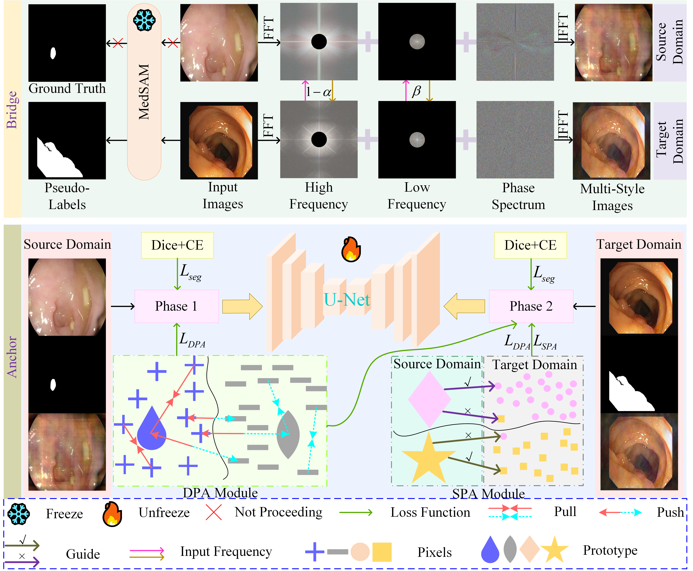

# :page_facing_up: Bridge-and-Anchor: Bidirectional Frequency Bridging and Prototype Anchoring for Stable Cross-Domain Medical Image Segmentation

<p align="center"></p>

### Dependency Preparation

```shell
cd Bridge-and-Anchor
# Python Preparation
conda create -n Bridge-and-Anchor python=3.10
activate Bridge-and-Anchor
# It is recommended to use the conda installation on the Pytorch website https://pytorch.org/
pip install -r requirements.txt
```

### Model Training

```shell
# Model Train
# Please generate images with diverse styles in Phase 1.py first.
# Please train the entire network using the original image and the generated image in Phase 2.py.
python Train.py
```

### Citation ✏️ 📄

If you find this repo useful for your research, please consider citing the paper as follows:

```
The paper has not yet been accepted.
```
